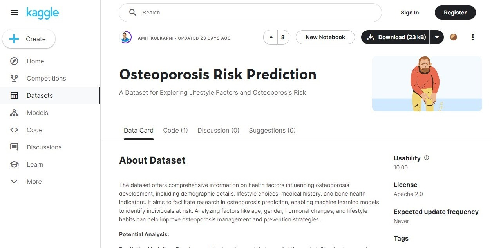
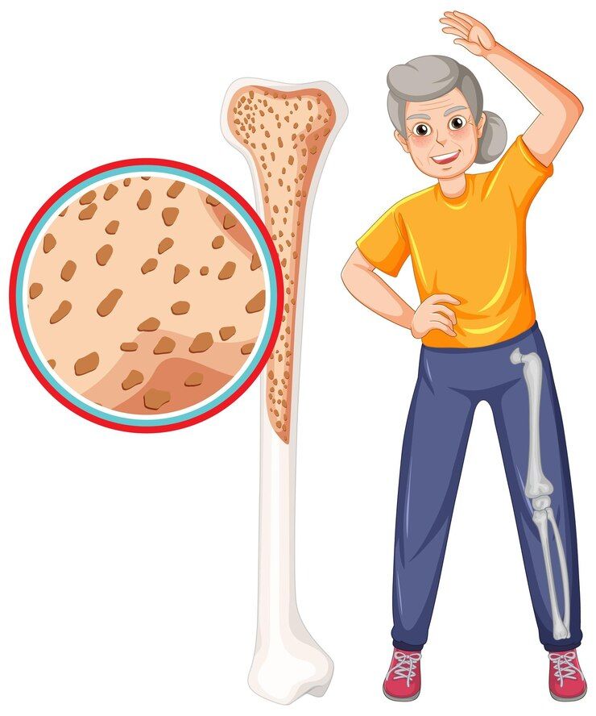

# estatistica_projeto_AdaTech
## 
Repositório dedicado ao projeto final do módulo 6 - Estatística - do programa **Vem Ser Tech - Dados**

**Participantes:** 

- <i class="fa fa-computer" aria-hidden="true"></i>:computer:
**Andreza Oliveira**
- <i class="fa fa-computer" aria-hidden="true"></i>:computer:
**Camila Lima**
- <i class="fa fa-computer" aria-hidden="true"></i>:computer:
**Lívia Nobre**
  
## Conteúdo
- [Sobre o Projeto](#Sobreoprojeto)
- [Objetivos](#Objetivos)
- [Dataset Utilizado](#DataSetUtilizado)
- [Insights](#Insights)
- [Metodologia](#Metodologia)
- [Conclusão](#Conslusão)
  

## Sobre o Projeto
O projeto traz um conjunto de dados que oferece informações abrangentes sobre os fatores de saúde que influenciam no desenvolvimento da osteoporose, incluindo detalhes demográficos, escolhas de estilo de vida, histórico médico e indicadores de saúde óssea.

 

 

## Objetivos
Facilitar a pesquisa na previsão da osteoporose, permitindo que modelos de aprendizado de máquina identifiquem indivíduos em risco;
Analisar fatores como idade, gênero, mudanças hormonais e hábitos de vida pode ajudar a melhorar as estratégias de gestão e prevenção da osteoporose.

## Dataset Utilizado
O dataset utilizado foi encontrado na plataforma Kaggle, trata sobre  casos de osteoporose. 
https://www.kaggle.com/datasets/amitvkulkarni/lifestyle-factors-influencing-osteoporosis

 

 

## Insights
- Desenvolver modelos de aprendizado de máquina para prever a probabilidade de osteoporose com base nas características fornecidas;
- Determinar a importância de cada característica na previsão do risco de osteoporose;
- Examinar correlações entre diferentes características e risco de osteoporose;
- Analisar como o risco de osteoporose varia em diferentes subgrupos com base em características demográficas, fatores de estilo de vida ou histórico médico;
- Interpretar os modelos treinados para entender como diferentes características contribuem para a previsão do risco de osteoporose.

## Metodologia
Foi utilizada a plataforma Kaggle para selecionar um conjunto de dados sobre osteoporose. Posteriormente o uso do Google Colab e da linguagem Python foram utilizados para realizar a análise, além de modelos estatísticos. Abaixo contém o passo a passo de como o projeto foi explorado:
- Análise Preliminar;
- Análise Exploratória;
- Análise Estatística;
- Visualização de Dados;
- Interpretação e Implicações;
- Limitações e Considerações.

## Conclusão

 Para prevenir a osteoporose, é fundamental ter:
- Alimentação saudável, investir em cálcio com laticínios, folhas verdes escuras e tofu. Assim também alimentos fontes de vitamina D como peixes gordurosos, ovos , leite enriquecido, luz solar ( em quantidade necessária);
- Exercício físico regular: Atividades com impacto, como caminhada, corrida, dança e treinamento de força. Além da manutenção de peso saudável já que o sobrepeso ou a obesidade aumentam o risco de osteoporose;
- Não fumar e limitação do consumo de álcool;
- Analisar o histórico familiar de osteoporose e/ou uso de medicamentos específicos que podem aumentar o risco da doença;

É de suma importância consultar um médico regularmente, é essencial para avaliar o risco de osteoporose e receber orientação sobre medidas de prevenção e tratamento. Uma vida saudável é fundamental para prevenir a osteoporose e manter a saúde óssea em todas as idades.

 

 
